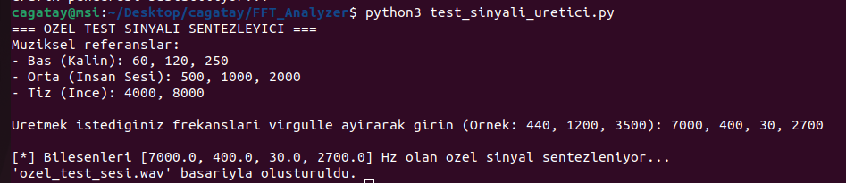
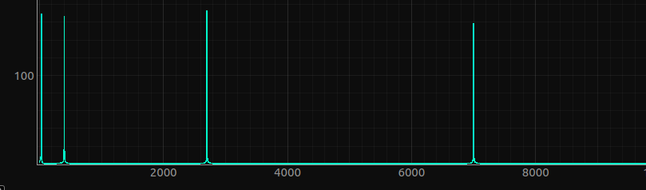

# FFT Analyzer: From-Scratch DSP Engine (C++ & Python)

---

## PROJE HAKKINDA

Bu proje, dijital sinyal işlemenin (DSP) temellerini kavramak amacıyla, herhangi bir dış kütüphane (FFTW vb.) kullanılmadan **saf C++** ile geliştirilmiş bir Hızlı Fourier Dönüşümü (FFT) analizörüdür.

Sistem, zaman düzlemindeki karmaşık ses verilerini frekans düzlemine çevirerek analiz eder. Python tabanlı bir otomasyon katmanı sayesinde YouTube linklerinden veya bilgisayarınızdaki yerel medya dosyalarından (MP3, MP4, WAV) veri çekebilir. Elde edilen frekans spektrumu, PyQtGraph kütüphanesi kullanılarak fütüristik ve etkileşimli bir masaüstü arayüzünde görselleştirilir.

### Teknik Özellikler
* **C++ FFT Motoru:** Radix-2 özyinelemeli Cooley-Tukey algoritması ile yüksek verimli hesaplama.
* **Karmaşık Sayı Aritmetiği:** Operatör aşırı yükleme destekli özel `KarmasikSayi` sınıfı.
* **Gelişmiş WAV İşleyici:** 16-bit PCM Mono formatındaki ses verilerini doğrular ve işler.
* **Masaüstü Arayüzü:** PyQtGraph ile donanım hızlandırmalı, akıcı ve profesyonel grafik çizimi.
* **Test Laboratuvarı:** Matematiksel doğruluğu kanıtlamak için özel frekans sentezleyici modülü.

### Sistem Mimarisi

1.  **Giriş:** YouTube URL veya Yerel Medya dosyası seçilir.
2.  **Dönüştürme:** FFmpeg ile veri 16-bit Mono 44.1kHz WAV formatına getirilir.
3.  **Analiz:** C++ motoru binary veriyi okur ve FFT algoritmasını çalıştırır.
4.  **Görselleştirme:** Hesaplanan frekanslar PyQtGraph penceresinde interaktif olarak sunulur.

### Kurulum ve Çalıştırma
1.  **Repoyu klonlayın:**
    ```bash
    git clone [https://github.com/cagatay005/FFT_Analyzer.git](https://github.com/cagatay005/FFT_Analyzer.git)
    cd FFT_Analyzer
    ```
2.  **C++ motorunu derleyin:**
    ```bash
    make
    ```
3.  **Gerekli kütüphaneleri kurun:**
    ```bash
    pip install yt-dlp pyqtgraph PyQt5 numpy
    ```
4.  **Uygulamayı başlatın:**
    ```bash
    python3 analiz_arayuzu.py
    ```

### Doğrulama ve Test

Projenin matematiksel doğruluğunu test etmek için `test_sinyali_uretici.py` dosyasını kullanabilirsiniz. Belirlediğiniz saf frekanslar (örn: 440Hz, 8000Hz), analizör tarafından keskin birer iğne olarak tespit edilmelidir.

| Sentetik Sinyal Jeneratörü (Terminal) | Analizör Sonucu (PyQtGraph) |
| --- | --- |
|  |  |

**Analiz:** Yukarıdaki örnekte 30Hz, 400Hz, 2700Hz ve 7000Hz frekanslarından oluşan sentetik bir ses dosyası analiz edilmiş; C++ motoru bu frekansları spektrum üzerinde tam isabetle tespit etmiştir.

---

## ABOUT THE PROJECT

This project is a Fast Fourier Transform (FFT) analyzer developed from scratch using **pure C++** without relying on external DSP libraries. It is designed to demonstrate the core principles of Digital Signal Processing.

The system analyzes complex audio data by converting it from the time domain to the frequency domain. A Python-based automation layer allows fetching data from YouTube URLs or local media files (MP3, MP4, WAV). The resulting frequency spectrum is visualized in a futuristic and interactive desktop interface using the PyQtGraph library.

### Technical Features
* **C++ FFT Engine:** High-efficiency computation using the recursive Radix-2 Cooley-Tukey algorithm.
* **Complex Arithmetic:** Custom `KarmasikSayi` class with operator overloading support.
* **Advanced WAV Processor:** Validates and processes 16-bit PCM Mono audio data.
* **Desktop Interface:** Hardware-accelerated, smooth, and professional plotting with PyQtGraph.
* **Validation Lab:** Synthetic signal synthesizer module to verify mathematical accuracy.

### System Architecture

1.  **Input:** Select a YouTube URL or Local Media file.
2.  **Preprocessing:** FFmpeg converts the input to 16-bit Mono 44.1kHz WAV.
3.  **Core Analysis:** The C++ engine reads binary data and executes the FFT algorithm.
4.  **Visualization:** Calculated frequencies are displayed interactively in a PyQtGraph window.

### Installation & Usage
1.  **Clone the repository:**
    ```bash
    git clone [https://github.com/cagatay005/FFT_Analyzer.git](https://github.com/cagatay005/FFT_Analyzer.git)
    cd FFT_Analyzer
    ```
2.  **Build the C++ engine:**
    ```bash
    make
    ```
3.  **Install requirements:**
    ```bash
    pip install yt-dlp pyqtgraph PyQt5 numpy
    ```
4.  **Run the application:**
    ```bash
    python3 analiz_arayuzu.py
    ```

### Validation & Testing

You can use `test_sinyali_uretici.py` to verify the mathematical accuracy. Pure frequencies defined by the user (e.g., 440Hz, 8000Hz) should be detected as sharp peaks by the analyzer.

| Synthetic Signal Generator (Terminal) | Analysis result (PyQtGraph) |
| --- | --- |
|  |  |

**Analysis:** In the example above, a synthetic signal composed of 30Hz, 400Hz, 2700Hz, and 7000Hz was analyzed; the C++ engine successfully identified these frequencies with perfect accuracy.

---

## Yazar / Author
**Mustafa Cagatay OZDEM**
* GitHub: [@cagatay005](https://github.com/cagatay005)
* Linkedin: https://www.linkedin.com/in/mustafa-%C3%A7a%C4%9Fatay-%C3%B6zdem-04199a2b7/
